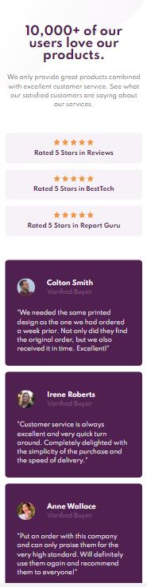

# Frontend Mentor - Social proof section solution

This is a solution to the [Social proof section challenge on Frontend Mentor](https://www.frontendmentor.io/challenges/social-proof-section-6e0qTv_bA). Frontend Mentor challenges help you improve your coding skills by building realistic projects.

## Table of contents

- [Overview](#overview)
  - [The challenge](#the-challenge)
  - [Screenshot](#screenshot)
  - [Links](#links)
- [My process](#my-process)
  - [Built with](#built-with)
  - [What I learned](#what-i-learned)
  - [Continued development](#continued-development)
- [Author](#author)

## Overview

### The challenge

Users should be able to:

- View the optimal layout for the section depending on their device's screen size

### Screenshot

### Links

- Solution URL: [https://github.com/Robert-Rynard/social-proof-section](https://github.com/Robert-Rynard/social-proof-section)
- Live Site URL: [https://robert-rynard.github.io/social-proof-section/](https://robert-rynard.github.io/social-proof-section/)

## My process

### Built with

- Semantic HTML5 markup
- CSS custom properties
- Flexbox
- Mobile-first workflow

### What I learned

This challenge provided good practice creating responsive sites of which I used flexbox to create. I also worked on writing more sematic HTML.

### Continued development

I used flexbox for this solution but I ended up with more wrapper divs than I would have preferred. This solution may have been better implemented using CSS Grid and going forward I plan on looking at the design and better deciding on whether or not Grid would be prefered over Flexbox.

## Author

- Website - [Robert Rynard](https://github.com/Robert-Rynard)
- Frontend Mentor - [@Robert-Rynard](https://www.frontendmentor.io/profile/Robert-Rynard)
- Twitter - [@robert_rynard](https://www.twitter.com/robert_rynard)
